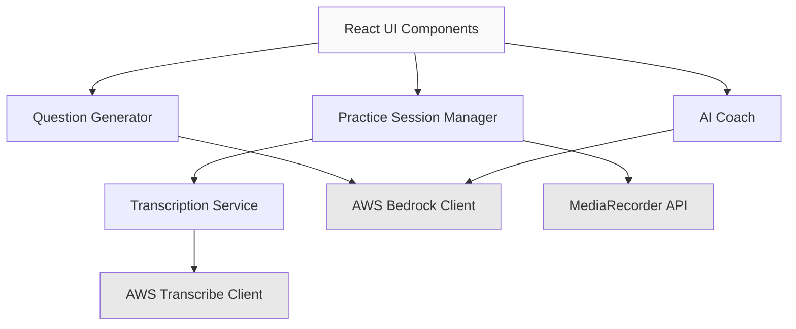

# Design Document: Interview Coach

## Overview

The Interview Coach is a web-based application that helps college students practice behavioral interview questions through AI-powered question generation, real-time speech transcription, and structured feedback based on the STAR format (Situation, Task, Action, Result).

The system integrates three AWS services:
- **AWS Bedrock (Amazon Nova Pro)**: Generates behavioral questions and analyzes responses
- **AWS Transcribe**: Provides real-time speech-to-text transcription via WebSocket streaming
- **Browser MediaRecorder API**: Captures audio from the user's microphone

The application follows a simple workflow:
1. User generates a behavioral interview question
2. User starts a practice session and speaks their answer
3. Audio is transcribed in real-time and displayed to the user
4. User stops the session when finished
5. AI analyzes the response for STAR format compliance
6. User receives constructive feedback with strengths, improvements, and actionable tips

## Architecture

### System Components



### Component Responsibilities

**Question Generator**
- Constructs prompts for behavioral question generation
- Calls AWS Bedrock with Amazon Nova Pro model
- Parses and validates generated questions
- Ensures questions cover diverse categories (leadership, teamwork, conflict resolution, problem-solving, failure/learning, time management)

**Practice Session Manager**
- Manages session lifecycle (start, active, stop states)
- Coordinates audio capture via MediaRecorder API
- Tracks session timing
- Orchestrates transcription service
- Maintains session state and transcription buffer

**Transcription Service**
- Establishes WebSocket connection to AWS Transcribe
- Streams audio chunks in real-time
- Receives and processes transcription events
- Handles connection lifecycle and errors
- Converts audio format to PCM as required by AWS Transcribe

**AI Coach**
- Analyzes transcribed responses for STAR format compliance
- Identifies presence/absence of each STAR component
- Generates constructive feedback with strengths and improvements
- Provides 2-3 actionable tips
- Uses encouraging language appropriate for college students

### Technology Stack

**Frontend**
- React for UI components and state management
- Browser MediaRecorder API for audio capture
- WebSocket for real-time transcription streaming

**Backend/Services**
- AWS Bedrock SDK (@aws-sdk/client-bedrock-runtime) for AI generation and analysis
- AWS Transcribe Streaming SDK (@aws-sdk/client-transcribe-streaming) for real-time transcription
- AWS credentials from CLI environment (uses default credential provider chain)

**Audio Processing**
- MediaRecorder API captures audio in browser-supported format
- Audio conversion to PCM 16kHz mono for AWS Transcribe compatibility
- Chunked streaming for real-time processing

## Components and Interfaces

### Question Generator Interface

```typescript
interface QuestionGenerator {
  generateQuestion(): Promise<GeneratedQuestion>;
}

interface GeneratedQuestion {
  question: string;
  category: QuestionCategory;
}

type QuestionCategory = 
  | 'leadership'
  | 'teamwork'
  | 'conflict-resolution'
  | 'problem-solving'
  | 'failure-learning'
  | 'time-management';
```

**Implementation Notes:**
- Uses AWS Bedrock `converse` API with Amazon Nova Pro model (amazon.nova-pro-v1:0)
- Prompt engineering ensures questions are appropriate for college students and entry-level candidates
- Timeout of 3 seconds enforced
- Returns category for tracking question diversity

### Practice Session Manager Interface

```typescript
interface PracticeSessionManager {
  startSession(): Promise<void>;
  stopSession(): Promise<SessionResult>;
  getSessionState(): SessionState;
  getElapsedTime(): number;
}

interface SessionResult {
  transcription: string;
  duration: number;
  audioData?: Blob;
}

type SessionState = 'idle' | 'starting' | 'active' | 'stopping';
```

**Implementation Notes:**
- Requests microphone permission on first start
- Manages MediaRecorder lifecycle
- Coordinates with Transcription Service
- Tracks elapsed time with 1-second granularity
- Handles microphone access errors gracefully

### Transcription Service Interface

```typescript
interface TranscriptionService {
  connect(): Promise<void>;
  startStreaming(audioStream: MediaStream): void;
  stopStreaming(): Promise<string>;
  onTranscript(callback: (text: string) => void): void;
  onError(callback: (error: TranscriptionError) => void): void;
}

interface TranscriptionError {
  code: string;
  message: string;
  recoverable: boolean;
}
```

**Implementation Notes:**
- Uses AWS Transcribe Streaming with WebSocket protocol
- Converts audio to PCM 16kHz mono format
- Buffers partial transcripts and emits complete phrases
- Maintains connection health and handles reconnection if needed
- Emits transcription updates within 1 second of speech

### AI Coach Interface

```typescript
interface AICoach {
  analyzeResponse(question: string, transcription: string): Promise<Feedback>;
}

interface Feedback {
  starAnalysis: STARAnalysis;
  strengths: string[];
  improvements: string[];
  actionableTips: string[];
}

interface STARAnalysis {
  situation: ComponentPresence;
  task: ComponentPresence;
  action: ComponentPresence;
  result: ComponentPresence;
}

type ComponentPresence = 'present' | 'partial' | 'missing';
```

**Implementation Notes:**
- Uses AWS Bedrock `converse` API with Amazon Nova Pro model
- Structured prompt ensures consistent STAR analysis format
- Generates 1+ strengths, specific improvements, and 2-3 actionable tips
- Uses encouraging, constructive language
- Timeout of 5 seconds enforced

### UI Component Structure

```typescript
interface InterviewCoachProps {}

interface InterviewCoachState {
  question: GeneratedQuestion | null;
  sessionState: SessionState;
  elapsedTime: number;
  liveTranscription: string;
  feedback: Feedback | null;
  error: ErrorState | null;
}

interface ErrorState {
  type: 'microphone' | 'transcription' | 'generation' | 'analysis';
  message: string;
  retryable: boolean;
}
```

## Data Models

### Question Model

```typescript
interface Question {
  id: string;
  text: string;
  category: QuestionCategory;
  generatedAt: Date;
}
```

### Session Model

```typescript
interface Session {
  id: string;
  questionId: string;
  startTime: Date;
  endTime: Date | null;
  duration: number;
  transcription: string;
  state: SessionState;
}
```

### Feedback Model

```typescript
interface FeedbackRecord {
  id: string;
  sessionId: string;
  starAnalysis: STARAnalysis;
  strengths: string[];
  improvements: string[];
  actionableTips: string[];
  createdAt: Date;
}
```

### AWS Bedrock Request/Response Models

**Question Generation Request:**
```typescript
interface BedrockConverseRequest {
  modelId: 'amazon.nova-pro-v1:0';
  messages: Array<{
    role: 'user';
    content: Array<{ text: string }>;
  }>;
  inferenceConfig?: {
    maxTokens?: number;
    temperature?: number;
  };
}
```

**Analysis Request:**
Similar structure to question generation but with different prompt content including the question and transcription.

### AWS Transcribe Streaming Models

**Transcribe Stream Configuration:**
```typescript
interface TranscribeStreamConfig {
  languageCode: 'en-US';
  mediaSampleRateHertz: 16000;
  mediaEncoding: 'pcm';
}
```

**Transcription Event:**
```typescript
interface TranscriptEvent {
  transcript: {
    results: Array<{
      alternatives: Array<{
        transcript: string;
      }>;
      isPartial: boolean;
    }>;
  };
}
```


## Correctness Properties

*A property is a characteristic or behavior that should hold true across all valid executions of a system—essentially, a formal statement about what the system should do. Properties serve as the bridge between human-readable specifications and machine-verifiable correctness guarantees.*

### Property 1: Question Generation Latency

*For any* question generation request, the Question_Generator should return a valid behavioral interview question within 3 seconds.

**Validates: Requirements 1.1**

### Property 2: Question Category Coverage

*For any* sequence of N question generation requests (where N ≥ 100), all six question categories (leadership, teamwork, conflict resolution, problem-solving, failure/learning, time management) should appear at least once in the generated questions.

**Validates: Requirements 1.3**

### Property 3: Button State Consistency

*For any* session state, the Start Practice Session button should be disabled if and only if a session is active, and the Stop Session button should be disabled if and only if no session is active.

**Validates: Requirements 2.4, 2.5**

### Property 4: Transcription Display Latency

*For any* transcription event received during an active session, the Interview_Coach should display the transcribed text in the UI within 1 second of receiving the event.

**Validates: Requirements 3.2**

### Property 5: Transcription Persistence

*For any* practice session, the complete transcription accumulated during the session should remain accessible after the session ends.

**Validates: Requirements 3.5**

### Property 6: Complete STAR Analysis

*For any* response analysis, the AI_Coach should return a STARAnalysis object containing all four components (Situation, Task, Action, Result), where each component has a valid ComponentPresence value ('present', 'partial', or 'missing').

**Validates: Requirements 4.3, 4.4**

### Property 7: Analysis Latency

*For any* practice session that ends with a transcription, the AI_Coach should complete the STAR analysis within 5 seconds of the session ending.

**Validates: Requirements 4.5**

### Property 8: Feedback Strengths Presence

*For any* completed analysis, the feedback should include at least one strength in the strengths array.

**Validates: Requirements 5.2**

### Property 9: Feedback Improvements Presence

*For any* completed analysis, the feedback should include at least one area for improvement in the improvements array.

**Validates: Requirements 5.3**

### Property 10: Actionable Tips Count

*For any* completed analysis, the feedback should include between 2 and 3 actionable tips (inclusive) in the actionableTips array.

**Validates: Requirements 5.4**

### Property 11: Timer Update Frequency

*For any* active practice session, the Session_Timer should increment the displayed elapsed time by 1 second for each 1-second interval that passes (±100ms tolerance for timing precision).

**Validates: Requirements 6.1**

### Property 12: Timer Format Compliance

*For any* timer value displayed during or after a session, the format should match the MM:SS pattern where MM is zero-padded minutes and SS is zero-padded seconds.

**Validates: Requirements 6.2**

### Property 13: Error Logging Completeness

*For any* service error that occurs (question generation failure, transcription failure, or analysis failure), the Interview_Coach should log the error with sufficient detail for debugging (including error type, message, and timestamp).

**Validates: Requirements 10.4**

## Error Handling

### Error Categories

**Microphone Access Errors**
- Permission denied by user
- Microphone not available or in use by another application
- Browser doesn't support MediaRecorder API

**Transcription Errors**
- WebSocket connection failure
- Unexpected disconnection during session
- No audio detected (silent input)
- AWS Transcribe service unavailable
- Invalid audio format

**AI Service Errors**
- Question generation timeout or failure
- Analysis timeout or failure
- AWS Bedrock service unavailable
- Invalid response format from Bedrock
- Rate limiting or quota exceeded

### Error Handling Strategy

**User-Facing Errors**
- Display clear, actionable error messages in the UI
- Distinguish between retryable and non-retryable errors
- Preserve user data (transcription) when possible
- Provide retry mechanisms for transient failures
- Guide users to fix permission or configuration issues

**Error Recovery**
- Gracefully degrade when services are unavailable
- Allow users to continue with available functionality
- Maintain application state consistency during errors
- Clean up resources (WebSocket connections, MediaRecorder) on error

**Error Logging**
- Log all errors with structured data (timestamp, error type, message, stack trace)
- Include context (session ID, question ID, user action)
- Log to console for development
- Prepare for future integration with error tracking service (e.g., Sentry)

**Specific Error Scenarios**

1. **Microphone Permission Denied**: Display message "Microphone access is required to practice. Please grant permission and try again." Keep Start button enabled for retry.

2. **WebSocket Connection Failure**: Display message "Unable to connect to transcription service. Please check your internet connection and try again." End session if active. Enable retry.

3. **No Audio Detected**: After 5 seconds of silence during active session, display message "No audio detected. Please check your microphone and speak clearly." Keep session active.

4. **Question Generation Failure**: Display message "Unable to generate question. Please try again." Keep Generate button enabled for immediate retry.

5. **Analysis Failure**: Display message "Unable to analyze your response, but your transcription has been preserved below." Show transcription to user. Enable starting new session.

6. **Service Unavailable**: Display message "AI service is temporarily unavailable. Please try again in a few moments." Provide retry button.

## Testing Strategy

### Dual Testing Approach

The Interview Coach will use both unit testing and property-based testing to ensure comprehensive coverage:

**Unit Tests** focus on:
- Specific examples of correct behavior (e.g., starting a session with granted permissions)
- Integration points between components (e.g., session manager coordinating with transcription service)
- Edge cases and error conditions (e.g., microphone permission denied, WebSocket disconnection)
- UI component rendering and user interactions

**Property-Based Tests** focus on:
- Universal properties that hold for all inputs (e.g., timer format always matches MM:SS)
- Comprehensive input coverage through randomization (e.g., question generation produces all categories)
- Invariants that must be maintained (e.g., button states always match session state)
- Performance requirements (e.g., latency constraints)

Together, unit tests catch concrete bugs in specific scenarios, while property-based tests verify general correctness across a wide range of inputs.

### Property-Based Testing Configuration

**Library**: fast-check (JavaScript/TypeScript property-based testing library)

**Configuration**:
- Minimum 100 iterations per property test
- Each property test must include a comment tag referencing the design document property
- Tag format: `// Feature: interview-coach, Property {number}: {property_text}`

**Example Property Test Structure**:
```typescript
// Feature: interview-coach, Property 12: Timer Format Compliance
it('should format all timer values as MM:SS', () => {
  fc.assert(
    fc.property(
      fc.integer({ min: 0, max: 3599 }), // 0 to 59:59
      (seconds) => {
        const formatted = formatTimer(seconds);
        expect(formatted).toMatch(/^\d{2}:\d{2}$/);
      }
    ),
    { numRuns: 100 }
  );
});
```

### Test Coverage Requirements

**Question Generator**
- Unit: Test specific question generation with mocked Bedrock responses
- Unit: Test timeout handling (3-second limit)
- Unit: Test error handling for Bedrock failures
- Property: Verify all questions complete within 3 seconds (Property 1)
- Property: Verify category coverage over many generations (Property 2)

**Practice Session Manager**
- Unit: Test session lifecycle (idle → starting → active → stopping → idle)
- Unit: Test microphone permission request flow
- Unit: Test timer initialization and reset
- Property: Verify button states match session state (Property 3)
- Property: Verify timer updates every second (Property 11)
- Property: Verify timer format compliance (Property 12)

**Transcription Service**
- Unit: Test WebSocket connection establishment
- Unit: Test audio streaming with mocked MediaRecorder
- Unit: Test connection cleanup on session end
- Unit: Test error handling for connection failures
- Property: Verify transcription display latency (Property 4)
- Property: Verify transcription persistence after session end (Property 5)

**AI Coach**
- Unit: Test STAR analysis with sample transcriptions
- Unit: Test feedback generation with various response qualities
- Unit: Test timeout handling (5-second limit)
- Unit: Test error handling for Bedrock failures
- Property: Verify complete STAR analysis structure (Property 6)
- Property: Verify analysis latency (Property 7)
- Property: Verify feedback contains required elements (Properties 8, 9, 10)

**Error Handling**
- Unit: Test each error scenario with appropriate mocks
- Unit: Test error message display in UI
- Unit: Test retry mechanisms
- Unit: Test resource cleanup on errors
- Property: Verify all errors are logged (Property 13)

**Integration Tests**
- End-to-end flow: Generate question → Start session → Transcribe → Stop → Analyze → Display feedback
- Error recovery: Simulate failures at each step and verify graceful handling
- UI interactions: Test button clicks, state transitions, and display updates

### Mocking Strategy

**AWS Services**
- Mock AWS Bedrock client for question generation and analysis
- Mock AWS Transcribe streaming client for transcription
- Use deterministic responses for unit tests
- Use randomized responses for property tests

**Browser APIs**
- Mock MediaRecorder API for audio capture
- Mock navigator.mediaDevices for permission handling
- Mock WebSocket for transcription streaming

**Time-Dependent Behavior**
- Use fake timers (e.g., Jest fake timers) for testing timer updates
- Control time progression in tests for latency verification

